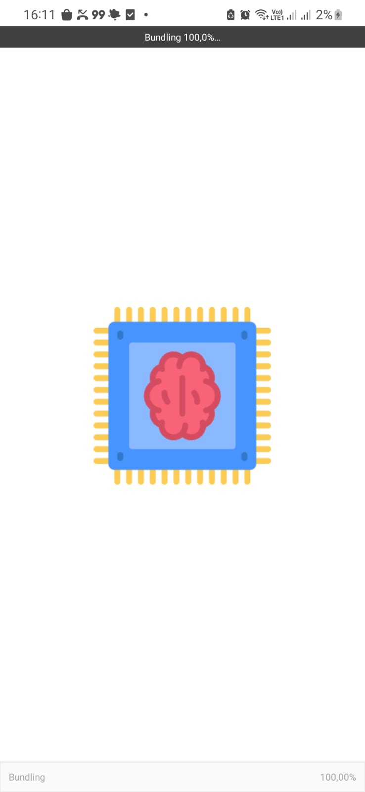
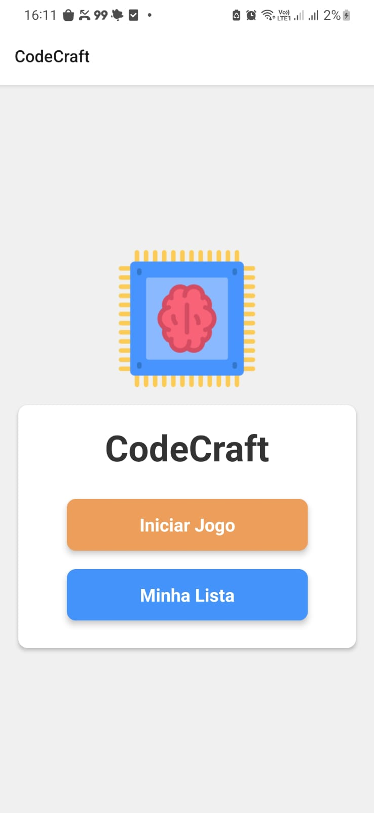
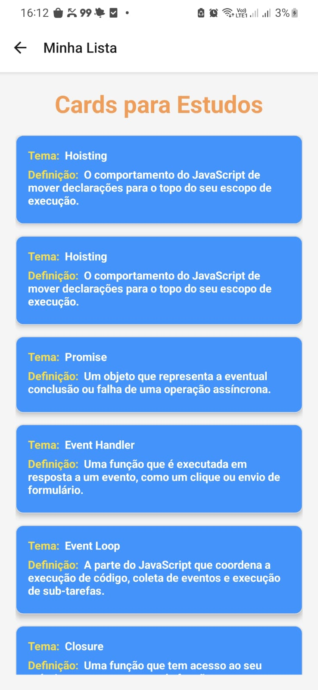
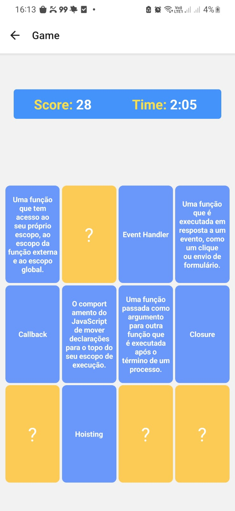
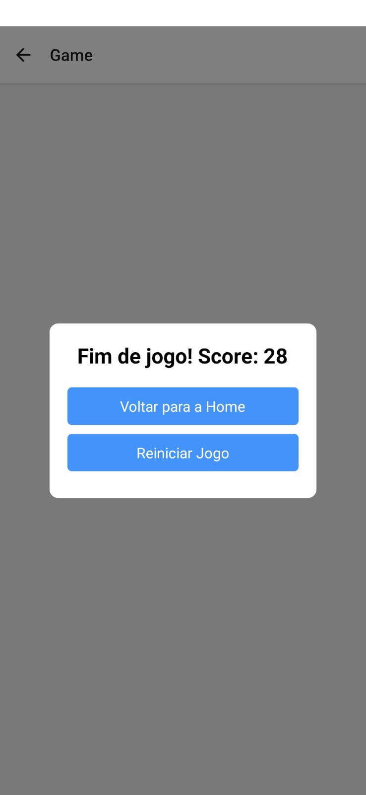

# CodeCraft 🧠  
**CodeCraft** é um jogo de memória interativo desenvolvido em **React Native**, **Expo** e **TypeScript**. O objetivo do jogo é combinar pares de conceitos e definições de JavaScript, ajudando os jogadores a aprender enquanto se divertem.

## 🎮 Funcionalidades  
- **Jogo de Memória**: Combine conceitos e definições de JavaScript, virando cartas e encontrando pares.  
- **Marcar para Estudo**: Dê um **duplo clique** nas cartas para salvá-las e revisá-las posteriormente.  
- **Pontuação e Temporizador**: Acompanhe sua pontuação e o tempo restante durante a partida.  
- **Design Responsivo**: Compatível com dispositivos móveis e emuladores de Android/iOS.  

---

## 🚀 Tecnologias Utilizadas  
- **React Native**: Biblioteca para desenvolvimento mobile.  
- **Expo**: Framework para simplificar o ambiente React Native.  
- **TypeScript**: Para um desenvolvimento mais seguro e tipado.  
- **React Navigation**: Gerenciamento de navegação entre telas.  
- **Async Storage**: Armazenamento local para salvar cartas marcadas para estudo.

---

## 📋 Pré-requisitos  
Antes de começar, certifique-se de ter os itens abaixo instalados:  
- [Node.js](https://nodejs.org/) (versão 14 ou superior).  
- [Expo CLI](https://docs.expo.dev/get-started/installation/) (instale com: `npm install -g expo-cli`).  
- [Git](https://git-scm.com/).  

---

## 🛠️ Como Rodar o Projeto Localmente  

### 1️⃣ Clonar o Repositório  

git clone https://github.com/seu-usuario/memory-game.git

### 2️⃣ Entrar na Pasta do Projeto

cd MemoryGame

### 3️⃣ Instalar Dependências

npm install

### 4️⃣ Iniciar o Projeto

npx expo start

## 📱 Executar no Dispositivo  

1. Após rodar o comando `npx expo start`, um **QR Code** será exibido no terminal ou na interface do Expo.  
2. Abra o aplicativo **Expo Go** no seu dispositivo móvel e escaneie o QR Code para iniciar o jogo.  
   - **iOS**: [Baixar na App Store](https://apps.apple.com/).  
   - **Android**: [Baixar na Google Play](https://play.google.com/).  
3. Para rodar o projeto em um emulador:  
   - Configure um **emulador Android/iOS** no seu ambiente local.  
   - Escolha a opção correspondente no terminal do Expo.  

---

## Tela de Carregamento do Jogo

### Assim que o jogo for iniciado, você será redirecionado para a tela de carregamento.

## Tela Inicial do Jogo

### Após a tela de carregamento, você será redirecionado para a tela inicial do jogo onde temos as opções de iniciar o jogo ou ir para a lista de cards para estudar.

## Aba com Lista de Cards para Estudar

### Aba com a lista de cards para estudar"

## Aba do Jogo

### Na tela inicial do jogo, os cards são renderizados com o conteúdo visível, permitindo que o usuário memorize os pares por 15 segundos. Após esse período, os cards são virados para baixo, ocultando o conteúdo. Para formar uma combinação, o usuário deve clicar em um card e, em seguida, tentar lembrar e selecionar o card correspondente ao seu par.

## Aba do Jogo em Andamento

### Na aba do jogo podemos verificar a nossa pontuação e o tempo restante.

## Jogo Finalizado

### Para o o jogo terminar o tempo precisa chegar a zero ou o usuário precisar acertar todos os pares. Quando finalizar aparece um pop up com a pontuação e a opção de jogar novamente ou voltar para a tela inicial.

### 🏗️ Estrutura do Projeto

O projeto foi desenvolvido com o conceito de componentização, facilitando a manutenção e a escalabilidade.

### Estrutura de Pastas

├───assets/
├───components/
│   ├── Card/
│   ├── Grid/
│   ├── Header/
├── screens/
│   ├── GameScreen/
│   ├── HomeScreen/
│   ├── StudyListScreen/
├── App.tsx

---

## 📦 Dependências Principais  

- **`expo`**: Framework para desenvolvimento React Native.  
- **`react-navigation`**: Gerenciamento de navegação entre telas.  
- **`@react-native-async-storage/async-storage`**: Armazenamento local para recursos persistentes.  
- **`react-native`**: Biblioteca base para o desenvolvimento mobile.  
